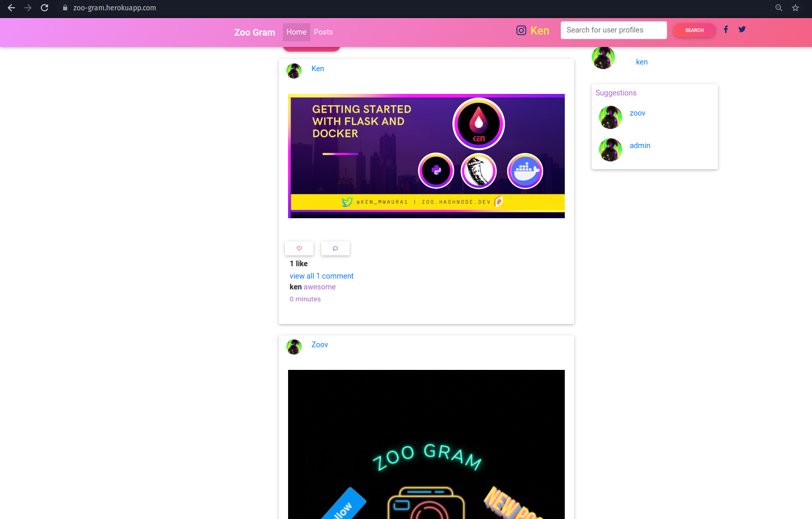
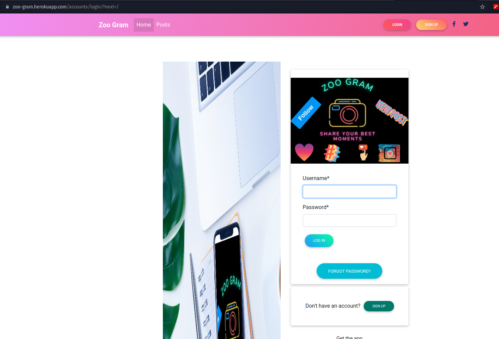
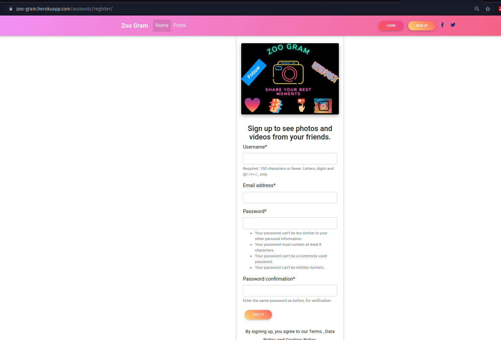
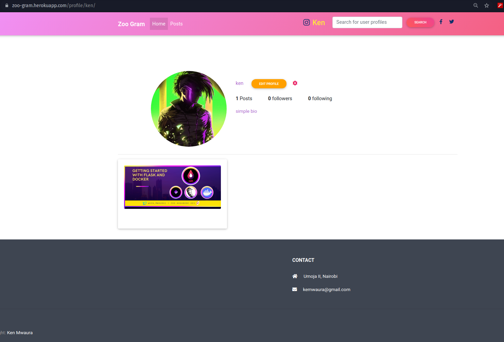
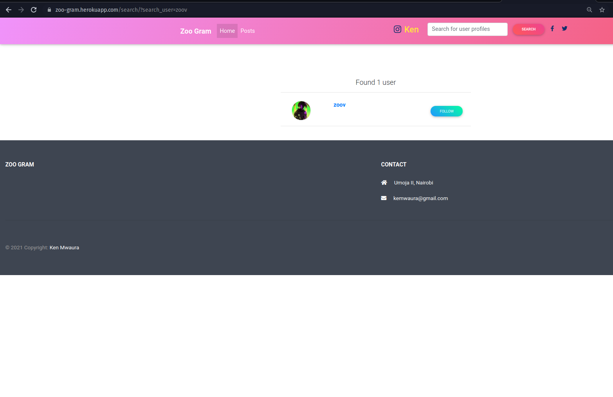
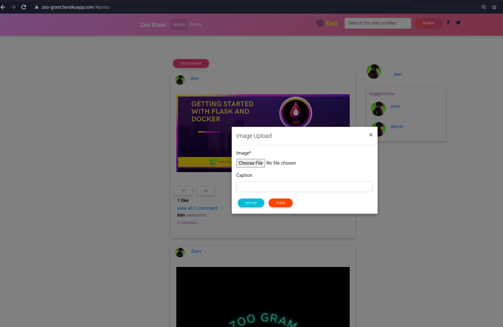

# zoo-gram
a Django clone of the website for the popular photo app Instagram.

[](https://www.python.org/)


## User stories
As a user of the application I should be able to:

1. Sign in to the application to start using. :heavy_check_mark:
2. Upload my pictures to the application. :heavy_check_mark:
3. See my profile with all my pictures. :heavy_check_mark:
4. Follow other users and see their pictures on my timeline. :heavy_check_mark:
5. Like a picture and leave a comment on it. :heavy_check_mark:

## Feature A: Image Model :heavy_check_mark:
Your Project should contain an Image model with the following properties:

1. Image
2. Image Name.
3. Image Caption.
4. Profile Foreign key
5. Likes
6. Comments


## Feature B: Profile model :heavy_check_mark: 
Create the Profile model with the following properties:

* Profile Photo
* Bio
* Remember to make migrations to your database when you change the properties of the model.

## Feature C: Image Model methods 
Your Image model should contain at least the following methods:

* save_image() - Save an image to the database.
* delete_image() - Delete image from the database.
* update_caption() - Update image caption in the database.

You should write tests for each of these methods and make sure you implement error handlers to prevent your application from crashing.

## Feature D: Profile model methods.
* You must implement the save, update and delete methods in the models.
* Make sure you write tests for each method

## Feature E: Search Functionality
Your project must have a search form that when submitted calls a search function in the view function and redirects to a search results page.

## Feature F: Image Details
When a user clicks on an Image he/she should be redirected to where the image is displayed and should also see the details of the Image.

## Feature H: an Authentication system
Your application should have a solid authentication system that allows users to sign in or register into the application before using it. When a user registers with your application they should receive a confirmation email.

## Showcase













## Live Site

[link to deployed site](https://zoo-gram.herokuapp.com/)

## Setup Instructions / Installation

### Getting Started

### Prerequisites

- Python and pip (I am currently using 3.9.7) Any version above 3.7 should work.
* Git installed on your machine
* Code editor/ IDE

### Installation and Running the App

1. Clone GitHub repository

    ```shell
    git clone https://github.com/KenMwaura1/zoo-gram
    ```

2. Change into the folder

    ```shell
   cd zoo_gram
    ```

3. Create a virtual environment

   ```shell
      python3 -m venv venv 
   ```

    * Activate the virtual environment

   ```shell
   source ./bin/activate
   ```

* If you are using [pyenv](https://github.com/pyenv/pyenv):

  3a. Create a virtualenv

   ```
       pyenv virtualenv zoo_gram
   ```

  3b. Activate the virtualenv

   ```
   pyenv activate zoo_gram
   ```

4. Create a `.env` file and add your credentials

   ```
   touch .env 
   ```

   OR Copy the included example

    ```
    cp .env-example .env 
    ```

5. Add your credentials to the `.env` file

    5a. Create a [free cloudinary account](https://cloudinary.com/) and get your credentials to enable photo uploading deployed.

   OR

    5b. Uncomment **line 15**  and **line 57** in **z_gram/models.py** to save and serve images locally. 
    


6. Migrate your database
    ```shell
    python manage.py migrate
    ```

7. Install the required dependencies

   ```shell
   pip install -r requirements.txt
   ```

8. Make the shell script executable

    ```shell
   chmod a+x ./run.sh
    ```

9. Run the app

    ```shell
   ./run.sh
    ```

   OR
   run with python

    ```shell
   python manage.py runserver
    ```

## Tests

* To run the tests:

    ```shell
  python manage.py test
    ```

## Technologies used

* Python-3.9.7
* Django web framework
* PostgreSQL
* Cloudinary
* Bootstrap(Material Bootstrap 4)
* HTML5
* CSS3

## Author

[Ken Mwaura](https://github.com/KenMwaura1)


## LICENSE

MIT License

Copyright (c) 2021 Kennedy Ngugi Mwaura

Permission is hereby granted, free of charge, to any person obtaining a copy
of this software and associated documentation files (the "Software"), to deal
in the Software without restriction, including without limitation the rights
to use, copy, modify, merge, publish, distribute, sublicense, and/or sell
copies of the Software, and to permit persons to whom the Software is
furnished to do so.
